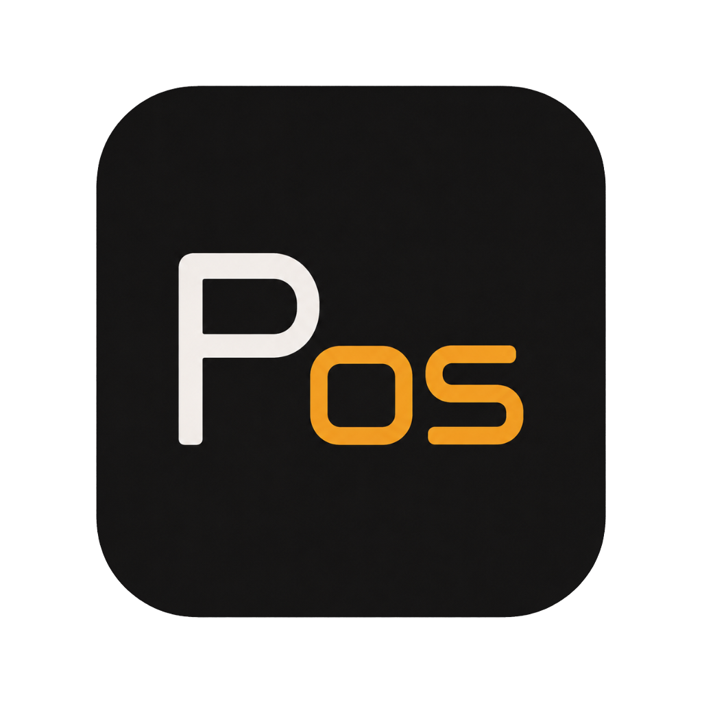

# PM Tool (PmT)

<div align="center">
  
  <h3>Enterprise Product Management Copilot &amp; Sprint Execution Workstation</h3>
  <p><b>Version 1.4.0</b> — Local-First, Privacy-Preserving Desktop Application for Windows</p>
</div>

---

## ⚡ Overview

**PM Tool** is an enterprise-grade product management copilot designed as a high-performance, local-first desktop application. It unifies traditional project and task management with an autonomous AI reasoning engine capable of ingesting local company documentation, drafting comprehensive Product Requirement Documents (PRDs), decomposing initiatives into agile user stories, connecting business databases/spreadsheets to interactive KPI dashboards, and providing high-leverage PM insights.

---

## 🌟 Key Features

### 📊 Data Studio, Custom KPI Dashboards & Guarded AI Integrations (`v1.4.0`)
- **Multi-Format Dataset Ingestion**: Ingests Excel (`.xlsx`, `.xls` via `openpyxl`), CSV, TSV, JSON records, and SQLite databases directly into an isolated local analytics store (`analytics_store.db`).
- **User-Defined KPI Cards & Benchmark Comparisons**: Configurable operations (`COUNT`, `SUM`, `AVG`, `MIN`, `MAX`), currency formatting (`$`, `€`, `₹`, `%`), target milestones, and dynamic ahead/behind tracking badges.
- **Pure SVG Responsive Charts**: Category-grouped Vertical Bar charts with hover tooltips, multi-color Donut share breakdowns, and safe 50-row paginated data tables.
- **Guarded SQL Sandbox**: Interactive read-only SQL exploration with AST validation, prohibited mutation blocking (`DROP`, `DELETE`, etc.), and driver-level read-only SQLite URI enforcement (`mode=ro`).
- **Contextual Copilot Knowledge & `/data` Command**: LLM system prompt receives schema metadata, column types, and live KPI metrics with zero raw PII leakage. Instant `/data` slash command pill for rapid analytical briefing.

### 📋 Interactive Sprint Kanban Board (`v1.3.0`)
- **4 Agile Workflow Lanes**: Backlog (`todo`), In Progress (`in_progress`), Blocked (`blocked`), and Completed (`done`).
- **HTML5 Drag-and-Drop**: Smooth card dragging with optimistic UI updates and background synchronization.
- **Sprint KPI Strip**: Real-time counters for Total Tasks, Fibonacci Story Points, In-Flight items, Blockers alert badge, and Velocity Completion Rate (`% Done`).
- **Automated PRD-to-Story Decomposer (`/breakdown`)**: Analyzes PRDs or project goals and generates structured agile user stories with Given/When/Then acceptance criteria and Fibonacci estimates (`1, 2, 3, 5, 8`).

### 💬 AI Copilot Studio & Slash Command Pills
- **Buttonish Command Pills**: Typing `/` triggers an autocomplete dropdown converting commands into high-contrast interactive badge containers (`/prd`, `/breakdown`, `/plan`, `/metrics`, `/summarize`, `/chat`).
- **8,192 Max Output Tokens**: Expanded generation budget guaranteeing complete, un-truncated coverage of multi-section enterprise specifications.
- **Cascading Multi-Provider Gateway**: Seamless fallback across local Ollama, native Google Gemini REST, and OpenAI-compatible proxy endpoints.

### 📁 Knowledge Base & Local RAG Pipeline
- **Deep Document Ingestion**: Ingests and parses `.pdf`, `.docx`, `.md`, `.txt`, `.csv`, and `.json` files.
- **Section-Aware Chunking & FTS5 BM25 Indexing**: Preserves heading hierarchy and performs lightning-fast Porter-stemmed BM25 keyword search.
- **Dual-Axis Sticky Table Navigation**: Custom-styled dark scrollbars with sticky table headers preventing layout distortion on wide metadata columns.

### 🔄 In-App Auto-Updating & CI/CD Pipeline
- **Differential Delta Updates**: Powered by `electron-updater` querying GitHub Releases (`Pranshul-Chopra/pm_tool`) using `.blockmap` differential files.
- **Silent Background Checks & In-App Toast**: 3-second startup check, recurring 4-hour background poll, and interactive sidebar update notification badge.
- **Graceful Process Teardown**: Automatically kills child Python processes before applying NSIS updates to prevent locked-file `EBUSY` errors.

### 🔌 Cascading Port Collision Resilience
- **16-Port Handshake**: Dynamically probes and binds ports `5050` through `5065` via socket checks, eliminating conflicts with zombie processes or competing developer tools.

### 🛡️ Local-First Security & Two-Database Partitioning
- **Operational Store (`%LOCALAPPDATA%\PMTool\pmtool.db`)**: SQLite with Write-Ahead Logging (`WAL`), foreign keys, and connection pooling for projects, tasks, and settings.
- **Trace Store (`%LOCALAPPDATA%\AIContextTool\ai_context.db`)**: SQLite FTS5 store for conversation threads, RAG chunks, and audit logs (`tool_runs`).
- **Machine-Bound PBKDF2/HMAC Encryption**: API keys are securely encrypted using Windows user profiles and machine salts.

---

## 🏗️ Tech Stack

- **Desktop Shell:** Electron (Chromium sandbox, custom window controls, safe IPC preload bridge)
- **Backend Server:** Flask 3.x (local loopback binding, origin verification, security middleware)
- **Databases:** SQLite 3 (WAL mode, FTS5 full-text search, thread-safe connection pooling)
- **AI / LLM Layer:** Local Ollama (`llama3.2`, `llama3.1`, `mistral`), Google Gemini REST API, OpenAI-compatible custom endpoints
- **Packaging:** PyInstaller (headless Flask backend) + electron-builder (NSIS 1-Click Installer & Portable Windows binaries)

---

## 📂 Project Structure

```text
pm_tool/
├── .github/
│   └── workflows/
│       └── release.yml          # Automated GitHub Actions CI/CD pipeline
├── .gitignore                   # Git exclusion list
├── README.md                    # Project overview & documentation landing page
├── RELEASE_WORKFLOW.md          # Packaging, publishing, and auto-update guide
├── CHANGELOG.md                 # Semantic versioning history
├── DEV_HANDBOOK.md              # Technical engineering handbook & architecture spec
├── requirements.txt             # Python dependencies
├── version.json                 # Single source of truth for version (1.4.0)
├── main.py                      # Flask factory, server lifecycle, ping checks
├── routes.py                    # REST API controllers & Jinja template routes
├── db.py                        # SQLite connection pool, schema migrations (pmtool.db)
├── ai_db.py                     # SQLite context store, conversation history, FTS5 index
├── notifier.py                  # Cross-platform desktop notification service
├── flask.spec                   # PyInstaller build specification
├── build.bat                    # 4-stage automated Windows build script
│
├── llm/                         # LLM Gateway and provider abstraction
│   ├── __init__.py
│   └── gateway.py               # Key encryption, Ollama probe, Gemini discovery, dispatch
│
├── rag/                         # Local-first document ingestion and retrieval pipeline
│   ├── __init__.py
│   ├── parsers.py               # Parsers for PDF, DOCX, MD, TXT, CSV, JSON
│   ├── chunker.py               # Section-aware sliding-window chunker
│   └── engine.py                # Directory scanner and BM25 retrieval
│
├── tools/                       # Deterministic PM productivity tools
│   ├── __init__.py
│   ├── document_generator.py    # Generates formatted DOCX documents
│   ├── summarizer.py            # Document summarizer with 8K token budget & SHA256 integrity
│   └── story_decomposer.py      # Automated PRD-to-Agile story decomposer
│
├── electron/                    # Desktop shell
│   ├── package.json             # Electron configuration & auto-updater targets
│   ├── main.js                  # Cascading port discovery, process supervisor, auto-updater
│   ├── preload.js               # Isolated IPC bridge (electronUpdater, electronNotifier, electronEnv)
│   ├── icon.ico                 # Multi-resolution Windows app icon (PmT)
│   └── icon.png                 # Taskbar & notification icon
│
├── static/                      # Static assets served by Flask
│   ├── favicon.ico              # Web favicon
│   ├── icon.png                 # Brand icon
│   └── fonts/                   # Offline IBM Plex Sans & Mono woff2 fonts
│       └── ibmflex.css
│
└── templates/                   # Jinja2 HTML templates
    ├── shell.html               # Main desktop shell layout & multi-frame manager
    ├── home.html                # Product workspace, roadmaps, and capabilities hub
    ├── board.html               # Interactive drag-and-drop Sprint Kanban Board
    ├── chat.html                # AI Copilot studio with buttonish slash command pills
    ├── documents.html           # Knowledge Base manager, dual scrollbars, FTS5 test bench
    └── settings.html            # AI provider configuration & secret manager
```

---

## 🛠️ Getting Started (Development)

### 1. Prerequisites
- **Python 3.11 or 3.13**
- **Node.js (v18+) & npm**

### 2. Python Environment Setup
```powershell
# Create and activate virtual environment
python -m venv venv
.\venv\Scripts\activate

# Install dependencies
pip install -r requirements.txt
```

### 3. Start Flask Backend
```powershell
python main.py
```
> The server will automatically discover and bind to an available port in the range `5050`–`5065`.

### 4. Start Electron Desktop Shell
In a separate terminal:
```powershell
cd electron
npm install
npm start
```

---

## 📦 Building Standalone Release Binaries

To produce the Windows 1-Click NSIS installer and Portable executable locally:

```powershell
# Set build flag
$env:CSC_IDENTITY_AUTO_DISCOVERY="false"

# Run automated 4-stage build script
.\build.bat
```

Output assets will be generated in `release/`:
- `release/PM Tool-Setup-1.4.0.exe` (1-Click NSIS Installer)
- `release/PM Tool-1.4.0.exe` (Portable Executable)
- `release/PM Tool-Setup-1.4.0.exe.blockmap` (Differential update map)
- `release/latest.yml` (Auto-update manifest)

---

## 📄 License & Ownership

PM Tool is developed and maintained by **Pranshul Chopra**. All rights reserved.
